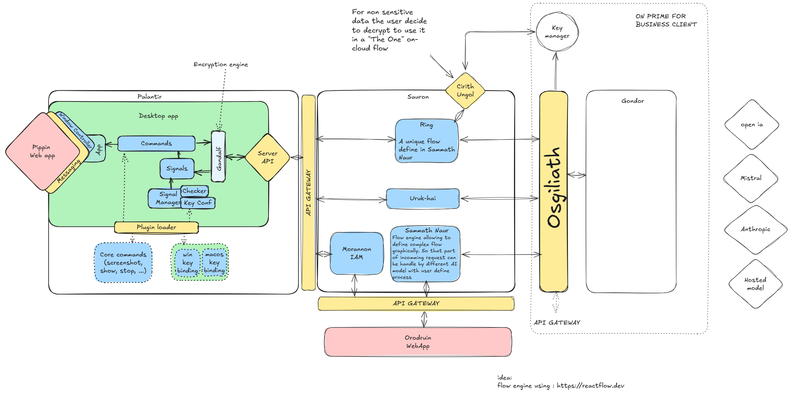

# Sauron System Architecture

## Overview

**Sauron** is a cloud-based **API workflow automation service** that allows users to define APIs using a **flow diagram UI**. The system enables users to upload custom code blocks in **JavaScript (JS), TypeScript (TS), or Rust** or to rely on **AI-generated inferences** for missing components. Once a user finalizes a flow (**"Ring"**), AI generates any remaining elements, validates the structure through testing, and ensures correctness before deployment.

The system is designed with **security and modularity** in mind, supporting **on-premise deployments** for sensitive data while offering **cloud-hosted** versions for scalability.

## Core Design Principles

### 1. AI-Driven Flow Creation

- Users create API flows using **Orodruin**, the flow editor web app.
- AI (**Sammath Naur**) completes missing components and generates test suites.
- AI iteratively fixes issues until all tests pass.
- Users manually validate before deployment.

### 2. Security & Encryption

- **Sauron** avoids direct access to sensitive user data.
- **Gandalf** (on the client-side) and **Osgiliath** (on the server-side) handle encryption.
- **Cirith Ungol** provides optional **on-premise** decryption for workflows requiring clear-text processing.
- The **Morannon** authentication service validates API calls and tokens.

### 3. Modular & Extensible

- Supports **custom services** in JS, TS, or Rust.
- Pluggable **AI models** (OpenAI, Mistral, Anthropic, and hosted models).
- APIs are exposed through **Sauron's API Gateway**.

## System Components

### 1. **Orodruin (Flow Editor Web App)**

- The UI where users design API workflows (**Rings**).
- Integrates with AI-powered code generation and testing.
- Communicates with **Sauron API Gateway** to save and deploy Rings.

### 2. **Sammath Naur (AI Code Generator & Tester)**

- Completes missing workflow components.
- Generates test suites and iteratively fixes errors.
- Ensures the final Ring is functional before deployment.

### 3. **Sauron API Gateway**

- Routes API calls to the appropriate **Ring**.
- Verifies requests using **Morannon IAM**.
- Ensures secure and efficient API handling.

### 4. **Cirith Ungol (Optional Decryption Service)**

- Provides **on-premise** decryption for Rings that require access to raw data.
- Prevents **Sauron** from handling unencrypted data.

### 5. **Uruk-hai (Proxy Service)**

- Simple passthrough service that forwards API calls to **Osgiliath**.
- Reduces latency by handling high-throughput requests efficiently.

### 6. **Morannon (Identity & Access Management)**

- Handles user authentication.
- Issues and validates access tokens.
- Required for both **Palantir** (desktop app) and **Orodruin** (web app) interactions.

### 7. **Osgiliath (Decryption API Gateway)**

- Fetches decryption keys and processes queries for **Gondor**.
- Ensures encrypted data remains secure before forwarding requests.

### 8. **Gondor (AI Model Execution Layer)**

- Executes requests to third-party **AI providers** (OpenAI, Mistral, Anthropic, etc.).
- Supports hosted AI models for enterprise clients.

## Palantir: Virtual AI Assistant

### 1. Overview

**Palantir** is a **desktop virtual AI assistant** designed to operate **in the background without recording anything**. It passively listens for signals and becomes active only when the user triggers an interaction.

### 2. Features

- **Signal-Based Activation:** The **Signals module** listens for specific user interactions to trigger Palantir without constant monitoring.
- **Controlled Access to Screen Data:** 
  - Users define which parts of their screen are accessible.
  - The assistant can process:
    - **Clicked zones**
    - **Entire windows**
    - **Full screen**
- **Direct API Querying:** Users can enter a prompt and send requests to **Sauron via Uruk-hai**.
- **Ring-Based Execution:** Users can select a predefined **Ring** before submitting a query to structure responses more effectively.
- **Flexible UI Rendering:**
  - UI is managed via a **webview component**.
  - Supports both predefined UI elements and **AI-generated HTML responses** as query outputs.

### 3. Workflow

1. **User triggers an interaction** (e.g., selecting part of the screen or entering a prompt).
2. **Palantir** activates and processes the query.
3. **Query is sent to Sauron** via **Uruk-hai**.
4. **If a Ring is selected, it structures the query flow**.
5. **Response is displayed in the webview**, either as:
   - A structured UI element.
   - A fully AI-generated HTML page.

## Security Model

### 1. **Encryption & Data Protection**

- **Gandalf (Client-Side Encryption):** Ensures data is encrypted before leaving the user's environment.
- **Osgiliath (Server-Side Decryption API):** Fetches keys and decrypts data **only if required**.
- **Cirith Ungol (On-Premise Decryption):** Allows enterprises to keep sensitive data **off-cloud**.

### 2. **Authentication & Authorization**

- **Morannon IAM** issues **JWT tokens** for API authentication.
- Tokens are **validated** by the **Sauron API Gateway** before request execution.
- **Multi-factor authentication (MFA)** is enforced for high-security workflows.

### 3. **On-Premise vs. Cloud Hosting**

- **Sensitive data workflows** can run entirely **on-premise**.
- Cloud-hosted workflows only decrypt **minimal necessary data** via **Cirith Ungol**.

## Workflow Execution

### 1. **Designing a Flow (Ring)**

- User defines an API workflow in **Orodruin**.
- AI (**Sammath Naur**) completes missing components.
- AI generates a test suite and iteratively fixes failures.
- User validates and saves the Ring.

### 2. **Executing a Flow**

- Requests are sent to the **Sauron API Gateway**.
- The Gateway routes calls to:
  - **Uruk-hai** (if simple proxy is needed).
  - **Cirith Ungol** (if decryption is required).
  - **Osgiliath** (for AI-powered execution).
- Responses are sent back **securely** to the client.

## Future Considerations

- **Deciding on Ring Binary Storage:** Currently under discussion.
- **Expanding Model Support:** Adding new AI models for workflow execution.
- **Performance Optimizations:** Improving the efficiency of the **Uruk-hai** proxy service.
- **Enhanced Security Auditing:** Providing cryptographic proofs for sensitive workflows.

## Conclusion

Sauron provides a **secure, AI-powered workflow automation platform** with **modular execution, strong encryption**, and **scalable API integrations**. With **Orodruin** for flow design, **Sammath Naur** for AI-driven validation, and **Osgiliath** for secure execution, the system ensures **flexibility, security, and ease of use** for developers and enterprises alike.

