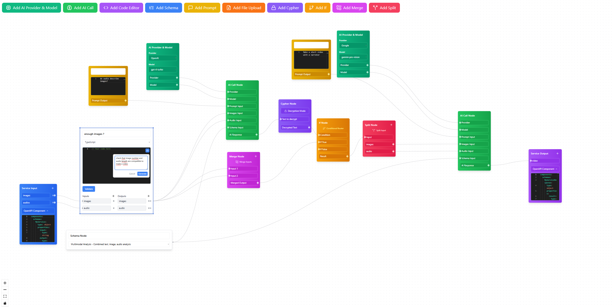

# Orodruin Design Philosophy

## Overview

Orodruin, named after the fiery mountain in Mordor from the Lord of the Rings mythology, is the flow editor web application that serves as the primary interface for users to design their API workflows ("Rings"). This document outlines the design philosophy, visual language, and user experience principles that guide Orodruin's development.

## Design Principles

### 1. Intuitive Flow-Based Programming

Orodruin embraces a **node-based visual programming paradigm** that allows users to:
- Create workflows by connecting nodes representing different operations
- Visualize data flow between components
- Understand complex relationships at a glance
- Reduce the learning curve for non-technical users

### 2. Dark Mode First Approach

The interface follows a **dark mode first** design philosophy to:
- Reduce eye strain during extended usage
- Provide high contrast for flow connections and node boundaries
- Create a modern, professional aesthetic
- Support light mode as an alternative option

### 3. Visual Hierarchy & Information Density

Orodruin balances information density with clarity through:
- **Card-based nodes** with clear boundaries and shadows
- **Color-coded node types** for quick identification
- **Connection lines** with directional indicators
- **Collapsible panels** for detailed configuration
- **Minimap navigation** for large workflows

## Visual Language

### Color Palette

- **Primary Brand Color**: Deep purple (#5D4777) - representing the mystical nature of Sauron
- **Secondary Accent**: Amber/gold (#FFC107) - representing the One Ring
- **Background**: Dark charcoal (#1E1E1E) - providing contrast for the workflow elements
- **Success States**: Emerald green (#4CAF50)
- **Error States**: Ruby red (#F44336)
- **Warning States**: Amber (#FF9800)
- **Information**: Azure blue (#2196F3)

### Typography

- **Primary Font**: "Fira Code" - a monospaced font with programming ligatures
- **Secondary Font**: "Inter" - a clean sans-serif for UI elements
- **Heading Hierarchy**: Clear size differentiation (24px, 20px, 16px)
- **Code Blocks**: Syntax highlighting with the "One Dark Pro" theme

### Iconography

- **Minimalist Line Icons**: Simple, recognizable shapes
- **Consistent 24x24 Grid**: Ensuring visual harmony
- **Functional Indicators**: Icons that clearly communicate purpose
- **Animated State Changes**: Subtle animations for state transitions

## User Experience Elements

### 1. Node Design

- **Input/Output Ports**: Clear visual indicators for connection points
- **Expandable Properties**: Click-to-expand for detailed configuration
- **Inline Documentation**: Hover tooltips for quick help
- **Status Indicators**: Visual feedback on node state (configured, error, processing)

### 2. Canvas Interaction

- **Infinite Canvas**: Unlimited workspace for complex flows
- **Zoom Controls**: Precision zoom for detailed work
- **Pan Navigation**: Intuitive drag navigation
- **Grid Snapping**: Optional alignment assistance
- **Multi-select**: Ability to manipulate multiple nodes simultaneously

### 3. AI Integration

- **AI Suggestion Highlights**: Subtle visual cues for AI-suggested components
- **Completion Confidence**: Visual indicators of AI confidence in generated code
- **Error Prediction**: Proactive highlighting of potential issues
- **Natural Language Command Bar**: AI-powered command interface

### 4. Responsive Design

- **Adaptive Layout**: Optimized for various screen sizes
- **Collapsible Panels**: Space-efficient UI components
- **Context-Aware Toolbars**: Tools that appear when needed
- **Touch-Friendly Targets**: Support for tablet interaction

## Animation & Microinteractions

- **Connection Animations**: Visual feedback when nodes are connected
- **Data Flow Visualization**: Optional animation showing data moving through connections
- **Smooth Transitions**: Easing functions for all state changes
- **Loading States**: Meaningful loaders that indicate progress

## Accessibility Considerations

- **Keyboard Navigation**: Complete keyboard control for all functions
- **Screen Reader Support**: ARIA labels and semantic HTML
- **Color Contrast Compliance**: WCAG AA standard minimum
- **Focus Indicators**: Clear visual focus states
- **Customizable Text Size**: Scalable interface elements

## Implementation Guidelines

### Component Architecture

Orodruin's UI is built using a **component-based architecture** with:
- Reusable React components
- Styled-components for consistent styling
- Context API for state management
- Custom hooks for shared functionality

### Performance Optimization

- **Virtualized Rendering**: Only rendering visible nodes
- **Memoization**: Preventing unnecessary re-renders
- **Lazy Loading**: Loading components as needed
- **Web Workers**: Offloading heavy computations

## Future Design Directions

- **3D Node Visualization**: Optional 3D view for complex workflows
- **AR/VR Integration**: Experimental immersive editing experience
- **Collaborative Editing**: Real-time multi-user editing capabilities
- **Custom Themes**: User-defined visual themes
- **Animation Editor**: Visual timeline for creating animated responses

## Conclusion

Orodruin's design philosophy centers on creating a powerful yet intuitive interface that empowers users to create complex API workflows with minimal friction. By combining visual programming concepts with AI assistance and thoughtful UX design, Orodruin aims to make API creation accessible to a broader audience while providing the depth and flexibility needed by experienced developers. 